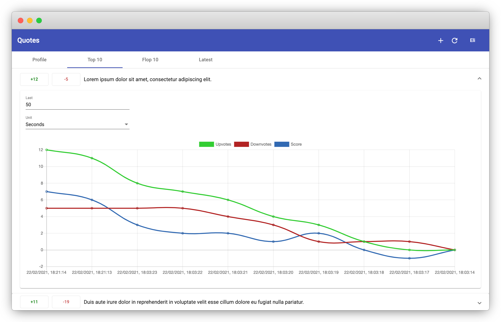

# Quotes: Kotlin, Spring Boot, Angular Material, Chart.js Quote Voting Web App

## Features
- Upvote/Downvote a quote
- Quote's score chart over time with the ability to change the grouping time unit
- Vote history with grouping options with different time units
## Build 🔨
```shell
./gradlew assemble && npm install && npm run build
```
## Run ⚡️
```shell
java -jar ./build/libs/quotes-1.0.0.jar
```
Open browser at: http://localhost:8080